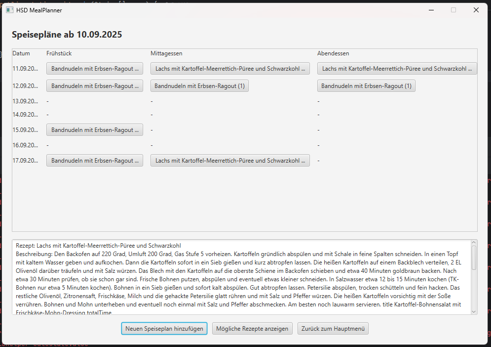

## Course 4: JavaFX
______

**ATTENTION:** When working with HSD lab computers, save ALL your work on the `H:\` drive!!!

Any data stored on `C:\` will only be saved to the local computer and can be deleted or manipulated by any other user. 
______

### Topic

 Implementing a Java FX Graphical user interface (GUI) as a part of an existing project.

### Tasks

1. Download the existing project within the source code of this repository and open it in an editor of your choice, preferably VSCode when working in the HSD Lab.
2. Create a new Class called `MealPlansScene.java` that inherits `Scene` and contains a method `create()` that returns the object as its return type.
3. Within this class, implement a daily meal planner that looks like this:

   
4. Explain why Maven is used in this context and how it aids in software and application development.

 **IMPORTANT:** if you have Java 21 installed instead of Java 17 (you can check the version with `java --version` in the terminal),
   you need to set the javafx-controls dependency version to 20 inside pom.xml!

***IMPORTANT for Apple💻🍎 Mac M1/M2/M3 (not Intel!) users at home...***

   Change the javafx-controls dependency, to include

   `<classifier>mac-aarch64</classifier>`

   *after* the version tag, or the UI will not start and the app will crash!
    
<!--
### **FOR MAC OS USERS**

If your MacBook uses arm64 instead of x86-64 architecture, there might be an issue where JavaFX Application are not executed. To resolve this, perform the following steps:
1. Uninstall Java 17 and install Java 21
-->

