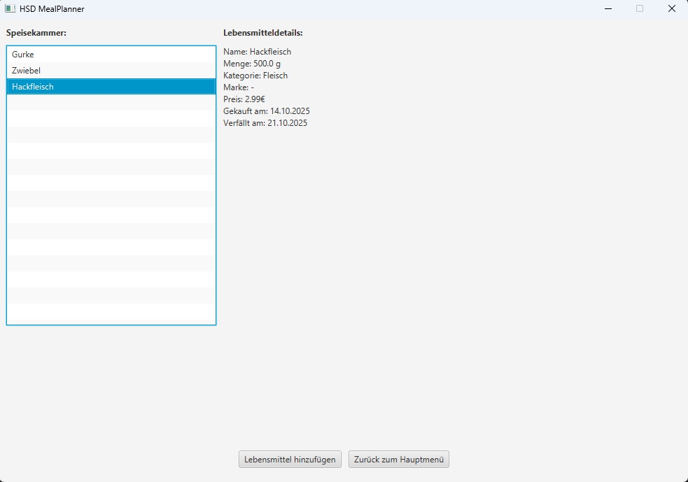

## Course 4: JavaFX
______

**ATTENTION:** When working with HSD lab computers, save ALL your work on the `H:\` drive!!!

Any data stored on `C:\` will only be saved to the local computer and can be deleted or manipulated by any other user. 
______

### Topic

 Implementing a Java FX Graphical user interface (GUI) as a part of an existing project.

### Tasks

1. Download the existing project from {Link} and open it in an editor of your choice, preferably VSCode when working in the HSD Lab.
2. Make yourself familiar with the codebase and how the JavaFX components are working together. Run the project and click through the JavaFX view while analyzing the code to figure out what each component does. One submenu is not implemented!
3. In the folder frontend/pages, create a new Class called `PantryPage.java` that inherits `Page` and contains a method `getView()` that returns the root as its return type. Inspiration on how this can be done may be obtained by analyzing already existing Page Classes.
4. Within this class, implement a view for all pantry contents that looks like this:
5. The page shall be accessible by clicking on **Speisekammer verwalten** in the Main Menu.

6. Behaviour of the page shall be as follows: On the left, list all items that are currently in the pantry. Upon clicking an item, its details shall be printed on the right side. The buttons **Lebensmittel hinzufügen** navigates to `AddGroceryPage`, **Zurück zum Hauptmenü** to `MainPage`.
7. Relevant and useful JavaFX components are:
   - VBox
   - HBox
   - BorderPane
   - Label
   - ListView
   - Insets
   - Button
   - Node.setOnMouseClicked()
   <!--You can ignore almost all Class Files within this Codebase, the only relevant ones for the implementation are: `NavigationButton`, `MealPlannerFX` from frontend; `MealPlannerService` from backend; and `DailyMeal`, `Route`, `Recipe` and `RecipeIngredient` from models. Inspiration and how to structure the page can be obtained from the other page classes. -->
8. instead of `Button`, use `NavigationButton`.
9. Explain why Maven is used in this context and how it aids in software and application development.
   

 **IMPORTANT:** if you have Java 21 installed instead of Java 17 (you can check the version with `java --version` in the terminal),
   you need to set the javafx-controls dependency version to 20 inside pom.xml!

***IMPORTANT for Apple💻🍎 Mac M1/M2/M3 (not Intel!) users at home...***

   Change the javafx-controls dependency, to include

   `<classifier>mac-aarch64</classifier>`

   *after* the version tag, or the UI will not start and the app will crash!
    
<!--
### **FOR MAC OS USERS**

If your MacBook uses arm64 instead of x86-64 architecture, there might be an issue where JavaFX Application are not executed. To resolve this, perform the following steps:
1. Uninstall Java 17 and install Java 21
-->

